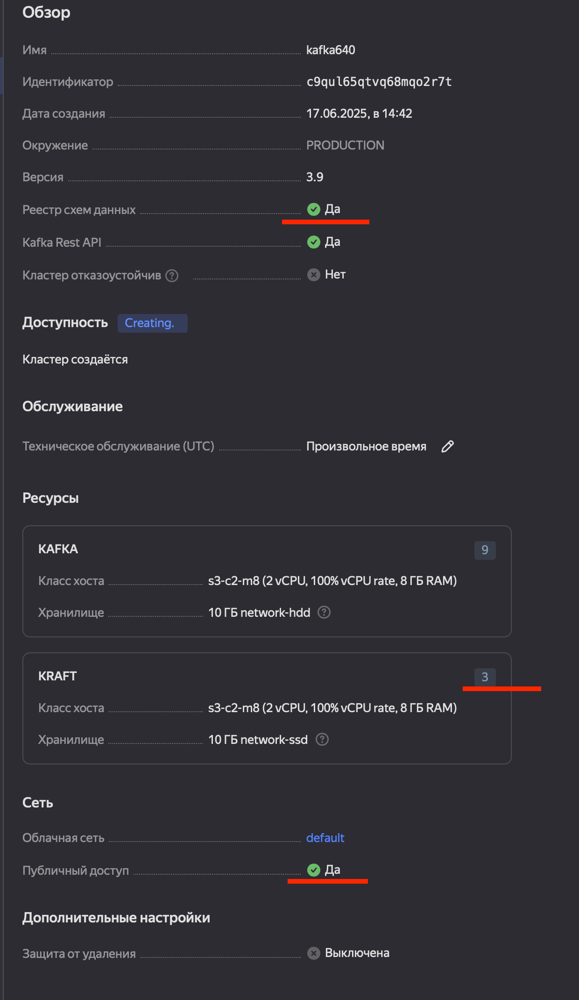
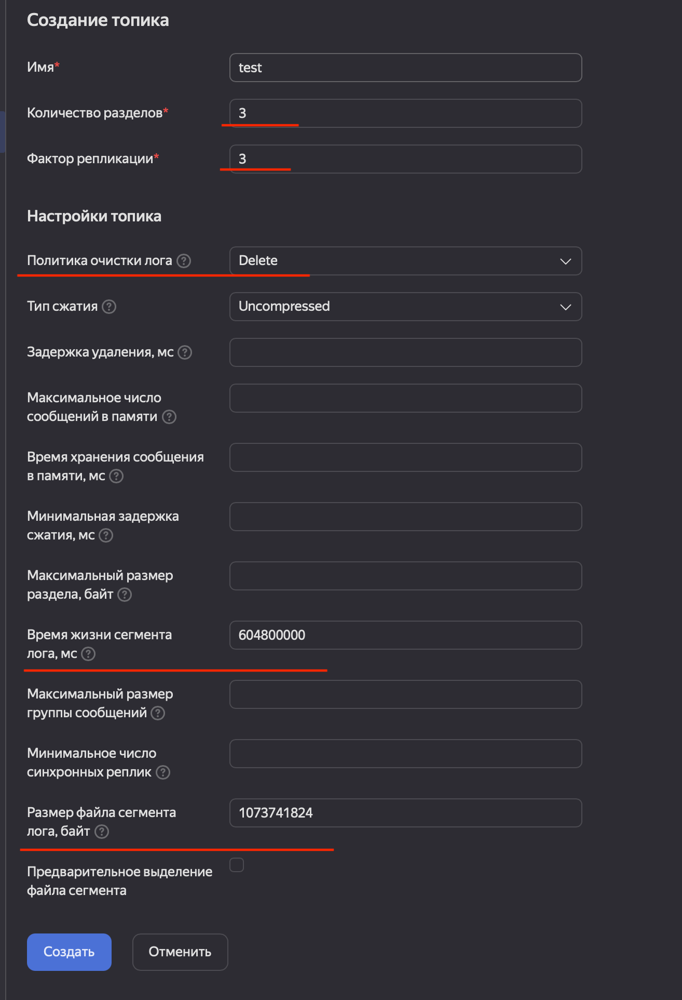
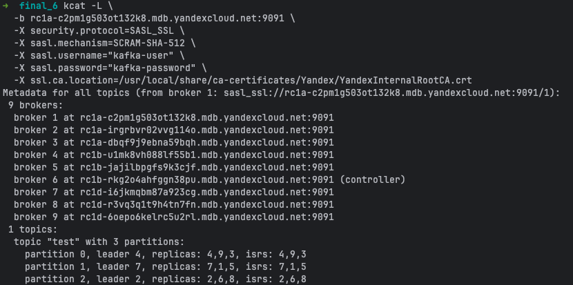
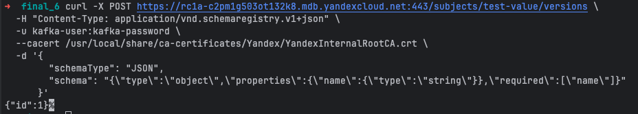
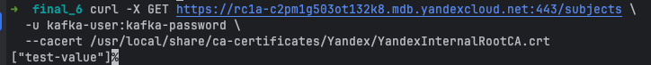
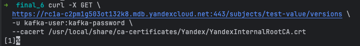
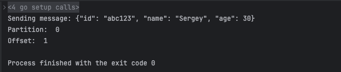
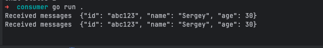

# Задание 1.Развёртывание и настройка Kafka-кластера в Yandex Cloud

## Шаг 1. Развернул Kafka
- указал минимальные, а не оптимальные параметры - потому что у меня и так достаточно денег списали в прошлый раз, обойдусь.
- в целом они же и есть оптимальные, т.к. вводных данных по требованиям в задании не представлено
- указал 3 брокера
- включил Schema Registry
- включил публичный доступ



## Шаг 2. Топики
- открыл кластер, перешел в раздел топики
- создал топик test, указал параметры, указанные в задании
- создал пользователя kafka-user / kafka-password - дал ему права на топик
- сделал команду аналогичную kafka-topics.sh --describe




## Шаг 3. Схема
- Schema Registry был развернут сразу
- Создал и сохранил схему в schema.json
- И зарегистрировал схему командой
```
curl -X POST https://rc1a-c2pm1g503ot132k8.mdb.yandexcloud.net:443/subjects/test-value/versions \
  -H "Content-Type: application/vnd.schemaregistry.v1+json" \
  -u kafka-user:kafka-password \
  --cacert /usr/local/share/ca-certificates/Yandex/YandexInternalRootCA.crt \
  -d '{
        "schemaType": "JSON",
        "schema": "{\"type\":\"object\",\"properties\":{\"name\":{\"type\":\"string\"}},\"required\":[\"name\"]}"
      }'
```




## Шаг 4. Проверка
- написаны продюсер и консьюмер


